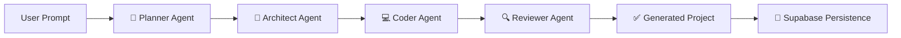

<div align="center">

# 🔮 DevOpus

### Software Development Automation with multiple agents working for you!

*Transform your ideas into production-ready React applications with multi-agent AI code generation.*

[](https://python.org)
[](https://nextjs.org)
[](https://fastapi.tiangolo.com)
[](https://anthropic.com)
[](https://supabase.com)

</div>

---

## ✨ What is DevOpus?

DevOpus is an **AI-powered code generation platform** that converts natural language descriptions (and even images!) into fully functional React + TypeScript applications — complete with live preview, code editing, and one-click export.

It uses a **multi-agent architecture** powered by Claude, where specialized AI agents handle different stages of the development pipeline:

```
📝 Planner → 🏗️ Architect → 💻 Coder → 🔍 Reviewer
```

Simply describe what you want to build, optionally upload a UI screenshot or wireframe, and watch as DevOpus plans, architects, codes, and reviews your application in real-time.

---

## 🎥 Features

- **🗣️ Natural Language Input** — Describe your app in plain English
- **🖼️ Vision-Powered Generation** — Upload UI mockups, wireframes, or screenshots to replicate designs
- **📄 PDF Support** — Upload PDF documents for context-aware generation
- **⚡ Real-Time Streaming** — Watch each stage (planning → architecting → coding → reviewing) as it happens
- **👁️ Live Preview** — Instant browser preview via Sandpack
- **📝 Code Editor** — Browse and inspect all generated files with syntax highlighting
- **🔄 Follow-Up Modifications** — Iterate on generated code with natural language instructions
- **📥 One-Click Export** — Download your complete project as a ZIP file
- **🎨 Stunning UI** — Best Outputs on your way!
- **🔐 User Authentication** — Sign up / sign in with email, Google, or GitHub via Supabase Auth
- **📊 Project Dashboard** — View, manage, and delete your saved projects
- **💾 Project Persistence** — Projects and code snapshots are automatically saved to Supabase
- **🔁 Project Restoration** — Reopen any previous project and continue iterating

---

## 🏗️ Architecture

DevOpus uses a **LangGraph-powered multi-agent pipeline** with specialized AI models:



| Agent | Model | Purpose |
|-------|-------|---------|
| **Planner** | Claude Sonnet 4.5 | Creates a structured product plan from user input |
| **Architect** | Claude Sonnet 4.5 | Designs implementation steps and system architecture |
| **Coder** | Claude Haiku 4.5 | Generates production-ready React/TypeScript code |
| **Reviewer** | Claude Sonnet 4.5 | Reviews code quality and provides improvement feedback |

---

## 🛠️ Tech Stack

### Backend
| Technology | Purpose |
|-----------|---------|
| **FastAPI** | REST API with SSE streaming |
| **LangGraph** | Multi-agent orchestration |
| **LangChain + Anthropic** | Claude LLM integration |
| **Supabase (Python)** | Project & version persistence |
| **Pydantic** | Data validation & structured outputs |
| **uv** | Python package management |

### Frontend
| Technology | Purpose |
|-----------|---------|
| **Next.js 16** | React framework with App Router |
| **Tailwind CSS 4** | Utility-first styling |
| **Supabase Auth UI** | Authentication (email, Google, GitHub) |
| **Sandpack** | In-browser code preview & execution |
| **Three.js** | 3D fluid gradient background |
| **Mermaid** | Architecture diagram rendering |
| **Lucide React** | Icon library |

---

## 🚀 Getting Started

### Prerequisites

- **Python 3.11+**
- **Node.js 18+** & npm
- **uv** (Python package manager) — [Install uv](https://docs.astral.sh/uv/)
- **Anthropic API Key** — [Get one here](https://console.anthropic.com/)
- **Supabase Project** — [Create one here](https://supabase.com/dashboard)

### 1. Clone the Repository

```bash
git clone https://github.com/ShashankSakilam/DevOpus.git
cd DevOpus
```

### 2. Set Up Environment Variables

**Backend (root `.env`):**
```bash
cp .sample_env .env
```

Edit `.env` and add your keys:
```env
ANTHROPIC_API_KEY=sk-ant-api03-your-key-here
SUPABASE_URL=https://your-project.supabase.co
SUPABASE_SERVICE_KEY=your-service-role-key
```

**Frontend (`frontend/.env.local`):**
```bash
cp frontend/.sample_env.local frontend/.env.local
```

Edit `frontend/.env.local`:
```env
NEXT_PUBLIC_SUPABASE_URL=https://your-project.supabase.co
NEXT_PUBLIC_SUPABASE_ANON_KEY=your-anon-key
```

### 3. Set Up Supabase Tables

In your Supabase SQL Editor, run:

```sql
-- Projects table
create table projects (
  id uuid default gen_random_uuid() primary key,
  user_id uuid references auth.users(id) on delete cascade,
  name text not null,
  description text,
  created_at timestamptz default now(),
  updated_at timestamptz default now()
);

-- Versions table
create table versions (
  id uuid default gen_random_uuid() primary key,
  project_id uuid references projects(id) on delete cascade,
  code_snapshot jsonb,
  plan_snapshot text,
  architect_snapshot text,
  diagram_snapshot text,
  review_snapshot text,
  created_at timestamptz default now()
);

-- Enable Row Level Security
alter table projects enable row level security;
alter table versions enable row level security;

-- RLS policies
create policy "Users can manage own projects" on projects
  for all using (auth.uid() = user_id);

create policy "Users can manage own versions" on versions
  for all using (
    project_id in (select id from projects where user_id = auth.uid())
  );
```

### 4. Install Backend Dependencies

```bash
uv sync
```

### 5. Install Frontend Dependencies

```bash
cd frontend
npm install
cd ..
```

### 6. Start the Application

**Terminal 1 — Backend:**
```bash
uv run uvicorn app:app --host 0.0.0.0 --port 8000 --reload
```

**Terminal 2 — Frontend:**
```bash
cd frontend
npm run dev
```

### 7. Open in Browser

Navigate to **[http://localhost:3000](http://localhost:3000)** and start building!

---

## 📁 Project Structure

```
DevOpus/
├── app.py                  # FastAPI server with streaming endpoints
├── db.py                   # Supabase database helper (CRUD for projects/versions)
├── utils.py                # Multimodal input processing (images, PDFs)
├── pyproject.toml          # Python dependencies
├── .sample_env             # Example backend environment variables
│
├── agent/                  # Multi-agent pipeline
│   ├── graph.py            # LangGraph agent definitions & workflow
│   ├── prompts.py          # System prompts for each agent role
│   ├── states.py           # Pydantic models (Plan, TaskPlan, etc.)
│   └── tools.py            # Agent tool definitions
│
├── frontend/               # Next.js 16 application
│   ├── .sample_env.local   # Example frontend environment variables
│   ├── src/
│   │   ├── app/
│   │   │   ├── page.tsx           # Landing page (3D fluid gradient)
│   │   │   ├── login/page.tsx     # Auth page (Supabase Auth UI)
│   │   │   ├── dashboard/page.tsx # Project dashboard
│   │   │   ├── generate/page.tsx  # Main generation workspace
│   │   │   ├── project/[id]/      # Project restore page
│   │   │   ├── globals.css        # Global styles & theme
│   │   │   └── layout.tsx         # Root layout with SupabaseProvider
│   │   ├── components/
│   │   │   ├── ChatInterface.tsx   # Left panel: chat + progress stages
│   │   │   ├── CodePreview.tsx     # Sandpack code preview & editor
│   │   │   ├── SmartInput.tsx      # Multimodal input with file upload
│   │   │   ├── DownloadBtn.tsx     # ZIP export functionality
│   │   │   ├── MermaidDiagram.tsx  # Architecture diagram renderer
│   │   │   ├── SupabaseProvider.tsx # Auth context provider & hook
│   │   │   └── ui/                # Reusable UI components
│   │   └── lib/
│   │       ├── supabase.ts        # Supabase browser client factory
│   │       └── utils.ts           # Utility functions (cn helper)
│   └── package.json
```

---

## 🎮 Usage

### User Flow

```
Home (/) → Start Building → Login (/login) → Dashboard (/dashboard) → Generate (/generate)
```

1. **Sign Up / Sign In** — Create an account or log in with email, Google, or GitHub
2. **Dashboard** — View your saved projects or start a new one
3. **Generate** — Describe your app, watch the AI build it in real-time
4. **Iterate** — Request follow-up modifications on generated code
5. **Restore** — Click any project card to reopen and continue working

### Text-Based Generation
1. Type a description like *"Build a modern todo app with dark mode and drag-and-drop"*
2. Click the submit button or press **Enter**
3. Watch the AI pipeline work through Planning → Architecting → Coding → Reviewing
4. Preview the result live, inspect the code, or download as ZIP

### Image-to-Code
1. Click the **+** button and select **Attach an image**
2. Upload a UI screenshot, wireframe, or design mockup
3. Add a prompt describing any modifications or context
4. The AI will analyze the image and replicate the design

### Follow-Up Modifications
After initial generation, use the bottom input bar to request changes:
- *"Add a dark mode toggle"*
- *"Make the sidebar collapsible"*
- *"Change the color scheme to blue"*

---

## 🔌 API Endpoints

| Endpoint | Method | Description |
|----------|--------|-------------|
| `/generate-stream` | POST | Stream project generation with SSE |
| `/followup-stream` | POST | Stream follow-up modifications |
| `/projects/{user_id}` | GET | List user's projects |
| `/projects/{project_id}` | DELETE | Delete a project |
| `/projects/{project_id}/latest` | GET | Get latest version snapshot |
| `/health` | GET | Health check |

---

## 🤝 Contributing

1. Fork the repository
2. Create a feature branch (`git checkout -b feature/amazing-feature`)
3. Commit your changes (`git commit -m 'Add amazing feature'`)
4. Push to the branch (`git push origin feature/amazing-feature`)
5. Open a Pull Request

---
